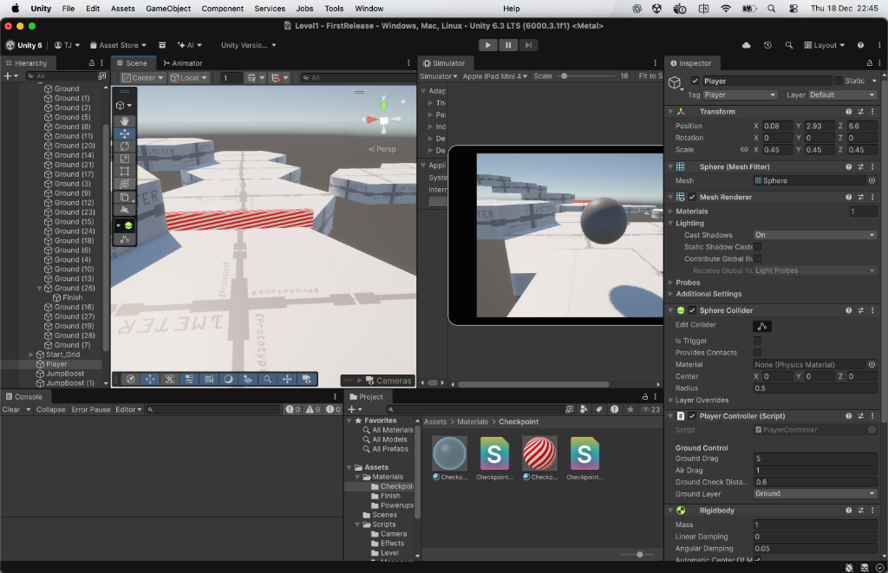
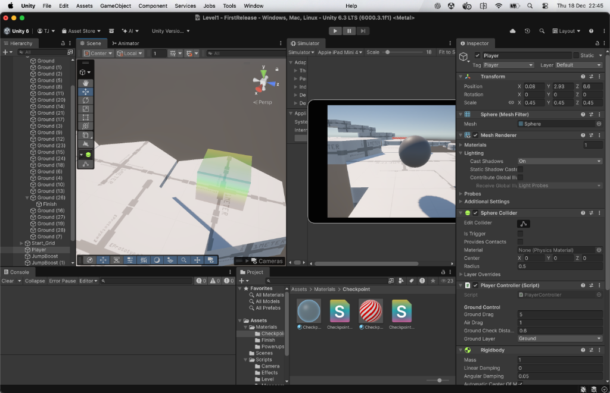
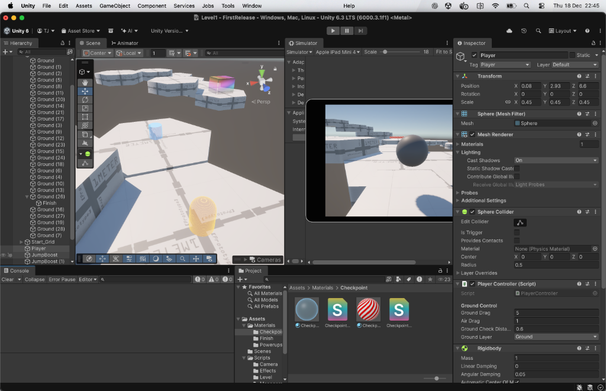

# Bounce 3D - Unity Platformer

A physics-based 3D platformer built in Unity featuring a ball player character navigating challenging levels with powerups and checkpoints.

## 📸 Gameplay Screenshots


*Custom shader materials: Checkpoint stripes, holographic powerups, and glass effects*


*Platform-based level design with visual effects*


*Rainbow finish line with celebration effects*

## 🎨 Visual Effects

### Shader Materials
- **Checkpoints**
  - Inactive: Animated red/white diagonal stripes scrolling right-to-left
  - Activated: Translucent glass with fresnel rim lighting and refraction
- **Powerups**
  - Holographic effects with animated scan lines and glitch distortions
  - SpeedBoost: Cyan/blue color scheme
  - JumpBoost: Orange/yellow color scheme
- **Finish Line**
  - Rainbow wave shader with HSV color cycling
  - Vertex animation creating rippling surface
  - Pulsing brightness and rim glow

### Particle Effects
- **Powerup Pickup**: Spiral burst particles with color-coded gradients
- **Level Completion**: Rainbow firework celebration with multiple explosion waves
- **Victory Launch**: Player shoots upward with massive force on finish

## 🎮 Features

### Core Gameplay
- **Physics-Based Movement**: Realistic ball rolling using Unity's Rigidbody physics
- **Camera-Relative Controls**: Movement direction adjusts based on camera orientation
- **Dynamic Camera System**: Smooth follow camera with orbital rotation
- **Jump Mechanics**: Ground detection with configurable jump force
- **Fall Respawn**: Automatic respawn when falling below a threshold

### Powerup System
- **Jump Boost**: Increases jump force permanently (+2 per pickup)
- **Speed Boost**: Increases movement speed permanently (+5 per pickup)

### Level Systems
- **Checkpoints**: Save progress at checkpoint locations
- **Spawn System**: Configurable spawn points using Unity tags
- **Level Finish**: Trigger-based level completion detection

### Game Management
- **Centralized Stats**: GameManager handles all player stats (speed, jump force)
- **Persistent State**: Stats persist across respawns
- **Modular Architecture**: Clean separation between control logic and data

## 🎯 Controls

| Input | Action |
|-------|--------|
| **W / Up Arrow** | Move Forward (Camera-relative) |
| **S / Down Arrow** | Move Backward (Camera-relative) |
| **A / Left Arrow** | Move Left / Rotate Camera Left |
| **D / Right Arrow** | Move Right / Rotate Camera Right |
| **Space** | Jump (When grounded) |

## 🏗️ Project Structure

```
Assets/
├── Scenes/
│   └── Level1.unity           # Main game scene
├── Scripts/
│   ├── Camera/
│   │   └── CameraFollow.cs    # Orbital camera follow system
│   ├── Level/
│   │   ├── Checkpoint.cs      # Checkpoint trigger logic
│   │   └── LevelFinish.cs     # Level completion detection
│   ├── Managers/
│   │   └── GameManager.cs     # Centralized game state & stats
│   ├── Player/
│   │   └── PlayerController.cs # Physics-based player movement
│   └── Powerups/
│       ├── JumpBoost.cs       # Jump force powerup
│       └── SpeedBoost.cs      # Speed powerup
└── Settings/                  # Universal Render Pipeline settings
```

## 🛠️ Setup Instructions

### Prerequisites
- **Unity 2022.3 LTS** or later
- **Universal Render Pipeline (URP)** package
- **Input System** package (New Input System)

### Installation

1. **Clone the repository**:
   ```bash
   git clone https://github.com/DPSDevops/Bounce-3D-Unity-.git
   cd Bounce-3D-Unity-
   ```

2. **Open in Unity**:
   - Open Unity Hub
   - Click "Add" and select the project folder
   - Open the project

3. **Configure Tags** (First-time setup):
   - Create a tag called **"Player"** and assign it to your player sphere
   - Create a tag called **"Spawn"** and assign it to your spawn point object
   - Create a **Ground Layer** and assign it to platform objects

4. **Scene Setup**:
   - Open `Assets/Scenes/Level1.unity`
   - Create an empty GameObject named "GameManager"
   - Attach the `GameManager.cs` script to it
   - Configure default stats in the Inspector

## 📝 Component Documentation

### GameManager
**Location**: Attach to an empty GameObject in the scene

**Inspector Settings**:
- **Default Ground Speed**: `10f` - Base movement force on ground
- **Default Air Speed**: `2f` - Movement force while airborne
- **Default Max Speed**: `5f` - Maximum velocity cap
- **Default Jump Force**: `5f` - Upward force for jumps
- **Fall Respawn Threshold**: `-10f` - Y-position to trigger respawn

### PlayerController
**Location**: Attach to the Player sphere GameObject

**Inspector Settings**:
- **Ground Drag**: `6f` - Friction when on ground
- **Air Drag**: `1f` - Drag when airborne
- **Ground Check Distance**: `0.6f` - Raycast distance for ground detection
- **Ground Layer**: Select the layer used for platforms

**Requirements**:
- Player must have a `Rigidbody` component
- Player must be tagged as **"Player"**

### CameraFollow
**Location**: Attach to the Main Camera

**Inspector Settings**:
- **Distance**: `10f` - Distance from player
- **Height**: `5f` - Height above player
- **Smooth Speed**: `10f` - Follow smoothness
- **Rotation Speed**: `100f` - Orbit rotation speed
- **Look At Player**: `true` - Keep camera facing player

### Checkpoint
**Location**: Attach to checkpoint trigger objects

**Inspector Settings**:
- **Activated Material**: Material to display when activated
- **Inactive Material**: Material before activation
- **Checkpoint Renderer**: Reference to the object's Renderer
- **Activation Effect**: Optional particle effect

**Requirements**:
- Collider must be set to **Is Trigger**

### Powerups (JumpBoost / SpeedBoost)
**Location**: Attach to powerup pickup objects

**Inspector Settings**:
- **Jump/Speed Increase Amount**: Value to add to player stats
- **Destroy On Pickup**: `true` - Remove after collection
- **Pickup Effect**: Optional particle effect prefab

**Requirements**:
- Collider must be set to **Is Trigger**

## 🎨 Creating Levels

1. **Create Platforms**:
   - Use Unity primitives or ProBuilder
   - Assign them to the **Ground Layer**
   - Add Colliders

2. **Set Spawn Point**:
   - Create an empty GameObject
   - Position it where players should start
   - Tag it as **"Spawn"**

3. **Add Checkpoints**:
   - Create a trigger object (e.g., platform or archway)
   - Set Collider to **Is Trigger**
   - Attach `Checkpoint.cs`
   - (Optional) Assign materials for visual feedback

4. **Place Powerups**:
   - Create a visual GameObject (sphere, cube, etc.)
   - Set Collider to **Is Trigger**
   - Attach `JumpBoost.cs` or `SpeedBoost.cs`

5. **Add Finish Line**:
   - Create a trigger object
   - Attach `LevelFinish.cs`
   - Set Collider to **Is Trigger**

## 🤝 Contributing

### Code Style
- Use XML documentation comments (`/// <summary>`)
- Follow Unity C# naming conventions
- Keep methods focused and single-purpose
- Separate concerns: Controllers handle input/physics, Managers handle state

### Architecture Guidelines
- **PlayerController**: Input capture and physics execution only
- **GameManager**: Centralized data and state management
- **Powerups**: Modify state through GameManager, never directly
- **Level Scripts**: Trigger-based event handlers

### Pull Request Process
1. Fork the repository
2. Create a feature branch (`git checkout -b feature/YourFeature`)
3. Commit your changes with clear messages
4. Push to your fork (`git push origin feature/YourFeature`)
5. Open a Pull Request with a detailed description

### Testing Checklist
- [ ] Player spawns at "Spawn" tag location
- [ ] Movement controls feel responsive on ground and in air
- [ ] Camera orbits correctly with A/D keys
- [ ] Jump only works when grounded
- [ ] Fall respawn triggers correctly
- [ ] Checkpoints update spawn position
- [ ] Powerups modify stats through GameManager
- [ ] Level finish detection works

## 🐛 Known Issues

- BoxCollider warnings about negative scale (Unity ProBuilder serialization - safe to ignore)
- Ensure ground layer is properly configured or ground detection may fail

## 📜 License

This project is open source and available under the MIT License.

## 🙏 Acknowledgments

Built with Unity 2022.3 LTS and Universal Render Pipeline.

---

**Made with ❤️ for Unity developers learning physics-based gameplay**
